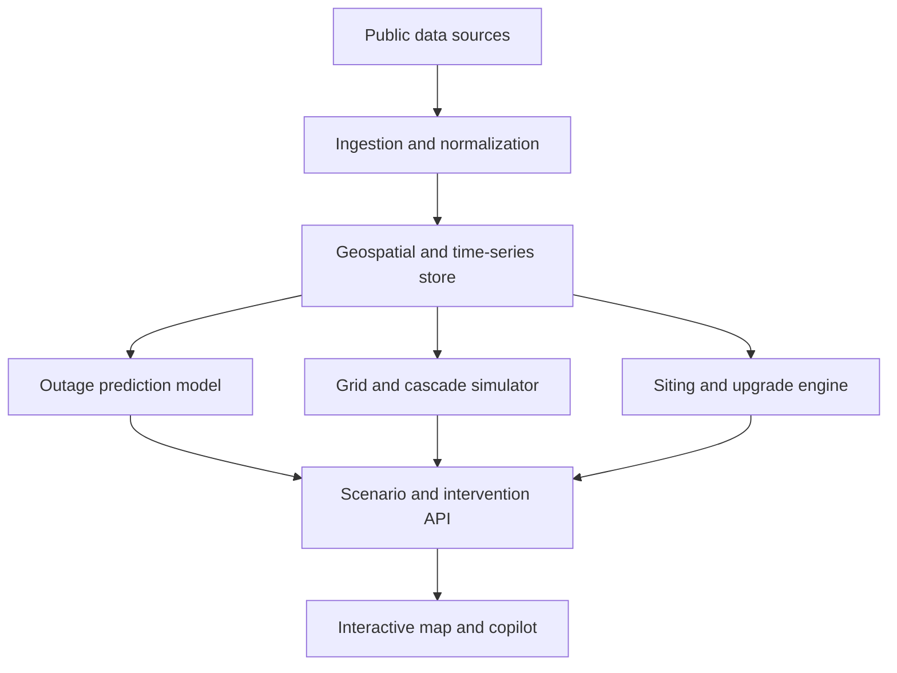

# GridMind

## National Grid Digital Twin for Outage Prediction, Cascade Analysis, and Resilient Energy Siting

**Project type:** Energy infrastructure, national resilience, causal AI, and decision intelligence  
**Primary users:** Utilities, regional transmission organizations (RTOs/ISOs), government agencies, energy developers, critical-infrastructure operators, and defense installations  
**Hackathon scope:** A Texas-focused working prototype designed to demonstrate a national-scale architecture

---

## 1. Project Summary

GridMind is an interactive digital twin of the United States electric grid that helps decision-makers answer three connected questions:

1. **Where is the grid most likely to fail?**
2. **How will a failure spread, and which communities or critical facilities will lose power?**
3. **Which intervention—new firm generation, line hardening, redispatch, storage, or a transmission upgrade—would reduce the most risk?**

The platform combines public grid, weather, outage, generation, geographic, and regulatory data with machine learning and power-flow simulation. Users can replay historical storms, explore forecast outage risk, trigger hypothetical equipment failures, watch cascades unfold, and compare proposed resilience investments.

The flagship use case is **nuclear and firm-generation siting**. GridMind evaluates candidate sites not only for safety and buildability, but also for how much they strengthen the surrounding grid. It can estimate whether placing a 300 MW or 1 GW source at a retired coal plant, existing nuclear site, federal energy site, or defense installation would reduce expected unserved energy, relieve congestion, improve black-start capability, or keep critical facilities online during a major disruption.

GridMind is not merely a map or chatbot. Its recommendations are produced by models and grid simulations; the language interface explains those results and links them to the underlying evidence.

---

## 2. The Problem

The United States is entering a period of rapid electricity-demand growth driven by data centers, reindustrialization, electrification, and expanding critical infrastructure. At the same time, the grid is fragmented across thousands of utilities and operators, and much of the detailed physical topology is restricted as Critical Energy Infrastructure Information (CEII).

Existing planning tools tend to separate problems that are fundamentally connected:

- Outage dashboards show where customers have already lost power but do not model the next cascade.
- Weather-risk tools estimate exposure but do not run electrical power flow.
- Grid simulators model lines and buses but often lack real county, customer, weather, and critical-load context.
- Generation-siting screeners evaluate environmental and regulatory constraints without measuring how a site changes system resilience.
- Regulatory reports contain valuable guidance, but the information is spread across long PDFs and disconnected databases.

As a result, planners struggle to compare interventions on a common basis. A technically feasible generation site may add little resilience, while a site with enormous grid value may face unacceptable population, seismic, flood, cooling-water, or regulatory constraints.

GridMind connects these decisions in one operating picture.

---

## 3. Core Value Proposition

GridMind turns fragmented public infrastructure data into a **decision engine for grid resilience**.

It enables a user to move from prediction to action:

> **Forecast the failure → simulate the cascade → identify affected critical loads → test interventions → compare outcomes → explain the recommendation.**

The system's distinctive output is a paired evaluation of every proposed energy site:

- **Safety and Buildability Score:** Can the facility responsibly and realistically be built here?
- **Grid-Strength Score:** How much safer and more resilient does the power system become if it is built here?

Most tools address only the first question. GridMind is designed to answer both.

---

## 4. Primary User Experience

The main interface is a national geospatial map built with deck.gl and MapLibre. For the hackathon prototype, the most complete data and simulations will focus on Texas, while the national view demonstrates how the architecture scales.

### Map layers

Users can toggle:

- Transmission lines and substations
- Power plants and generation type
- Balancing-authority and utility-service regions
- County-level predicted outage risk
- Live or historical storm polygons
- Wind, ice, heat, flood, and wildfire exposure
- Line loading and congestion
- Critical facilities such as defense installations, hospitals, and water infrastructure
- Retired coal plants, existing nuclear sites, federal sites, and other candidate generation locations
- Recommended line-hardening, dynamic-rating, and reconductoring opportunities

### Core interactions

A user can:

- Select a historical storm or forecast weather event.
- View county-level outage probabilities and customers at risk.
- Fail a line or substation manually.
- Play a cascade step by step as overloaded elements trip.
- See when a critical facility becomes disconnected or under-supplied.
- Add a hypothetical generator, storage resource, or hardened line.
- Rerun the same event as a counterfactual.
- Compare customer-hours lost, unserved energy, congestion, and critical-load protection before and after the intervention.
- Ask a natural-language question and receive a cited, evidence-based explanation.

---

## 5. Key Product Capabilities

### 5.1 National grid digital twin

GridMind uses an open, synthetic-but-realistic electrical network as its computational skeleton. Candidate sources include:

- Texas A&M ACTIVSg models
- Microsoft GridSFM
- PyPSA-USA

The electrical model is overlaid with real public geography, including transmission corridors, substations, power plants, counties, utility territories, balancing authorities, hazards, and critical facilities. A mapping table connects synthetic buses to real counties and balancing authorities so real load and outage observations can be attached to the simulation.

The prototype will clearly label synthetic topology. Detailed real topology is often restricted under CEII, but the architecture is designed so an authorized organization can later substitute its own network model without rebuilding the rest of the product.

### 5.2 Weather-driven outage prediction

A learned model estimates outage risk at the county level over the next 72 hours.

Potential inputs include:

- Wind speed and gusts
- Ice accumulation
- Temperature and heat stress
- Flood and wildfire exposure
- Season and vegetation conditions
- Historical county outages
- Utility reliability history, including SAIDI and SAIFI
- Regional load conditions

The initial implementation uses LightGBM because it is fast, explainable, and practical for a weekend prototype. The model can be trained using EAGLE-I county-level customers-out observations paired with NOAA and HRRR weather features.

Historical events such as Winter Storm Uri, Hurricane Beryl, and Hurricane Helene can be held out for replay-based validation. The output is not only an outage probability: it also identifies the most important predicted drivers and estimates customers at risk.

### 5.3 Cascade simulation

The cascade engine models what happens after weather or a user action removes grid components:

1. Convert weather severity into failure probabilities for exposed elements.
2. Remove failed lines, substations, or generators.
3. Run DC power flow on the remaining network.
4. Identify overloaded or electrically isolated elements.
5. Trip overloaded components according to the simulation rules.
6. Repeat until the network stabilizes.
7. Translate lost electrical load back into counties, customers, and critical facilities.

The initial implementation uses pandapower, with lightsim2grid as an optional performance enhancement. Grid2Op can later support an operator agent that tries redispatch, topology changes, load shedding, or other corrective actions.

### 5.4 Critical-load impact analysis

GridMind connects electrical failures to consequences decision-makers understand. Public locations for defense installations, hospitals, emergency services, and water systems are attached to the nearest modeled supply nodes.

Instead of reporting only that a bus was disconnected, GridMind can state:

- Which counties lost service
- How many customers were affected
- Which critical facilities were stranded
- At what point in the cascade they lost supply
- Which upstream elements caused the disconnection
- Which intervention would have prevented it

### 5.5 Nuclear and firm-generation siting

The siting engine evaluates candidate locations such as:

- Retired or retiring coal plants
- Existing nuclear-generation sites
- Federal energy and research sites
- Large defense installations
- Other brownfield sites with existing grid connections

Each candidate receives two independent scores.

#### Safety and Buildability Score

This score adapts published OR-SAGE/STAND-style criteria using public data:

- Population density near the site
- Seismic hazard
- Floodplain exposure
- Cooling-water availability
- Protected-land restrictions
- Terrain slope
- Wildfire risk
- State-level nuclear restrictions or moratoria
- Existing transmission and industrial infrastructure
- Brownfield reuse potential
- Likely regulatory pathway

#### Grid-Strength Score

This score is calculated by inserting a hypothetical resource—such as a 300 MW small modular reactor or a 1 GW firm generator—into the digital twin and rerunning stress scenarios.

The score measures changes in:

- Expected loss of load
- Unserved energy in MWh
- Customer-hours without power
- Congestion and line overloads
- Critical-load survivability
- Black-start reach
- Local reserve margin
- Dependence on vulnerable transmission corridors

The interface shows the three strongest reasons for a recommendation and the three largest risks or uncertainties.

### 5.6 Transmission headroom and upgrade recommendations

GridMind can also identify lower-cost interventions when new generation is not the best immediate answer.

For high-value transmission corridors, the system can compare:

- Dynamic line ratings based on weather-dependent ampacity
- Advanced reconductoring
- Targeted line hardening
- Storage near a constraint
- Demand flexibility or controlled curtailment
- Conventional capacity expansion

Lines can be ranked by estimated **megawatts unlocked per dollar**, congestion relieved, and resilience value. This capability lets the tool recommend an intervention portfolio rather than forcing every problem into a generation-siting solution.

### 5.7 Evidence-grounded copilot

The natural-language copilot provides a simple way to use the system without hiding the underlying calculations.

Example questions:

- “Where should the next 2 GW of firm generation go in Texas, and why?”
- “Which three substations create the greatest cascade risk for critical facilities?”
- “Would Winter Storm Uri have disconnected this installation if the recommended reactor had been operating?”
- “Why is this retired coal site preferred over the site near Houston?”
- “Which transmission upgrades unlock the most capacity per dollar in this region?”

The language model never performs grid mathematics itself. It calls typed tools such as:

- `predict_outage(county, horizon)`
- `run_cascade(element_ids, scenario)`
- `score_site(latitude, longitude, capacity)`
- `compare_interventions(scenario, intervention_ids)`
- `top_critical_elements(region, count)`
- `top_line_upgrades(region, technology, count)`
- `sql(query)`

It then explains structured results and retrieves relevant passages from regulatory and policy documents. Every factual or regulatory claim in the final answer should link to its source.

---

## 6. Causal-AI Approach

GridMind's causal layer distinguishes it from a correlation dashboard.

The grid simulator acts as a structural causal model. An intervention such as “place a reactor here,” “harden this line,” or “add storage at this bus” changes the system itself. The platform can then rerun the exact same weather and load conditions to estimate what would have happened under that intervention.

In causal language, these are explicit **do-operations** on the grid graph.

### Counterfactual replay

For a historical storm, GridMind displays:

- The observed outage map
- The simulated baseline cascade
- The counterfactual cascade with an intervention
- The difference in customers affected, unserved energy, restoration burden, and critical facilities protected

This makes the recommendation understandable: users can see the failure avoided rather than relying on a single opaque score.

### Learned causal model

A Bayesian network or structural causal model can represent relationships among:

> Weather severity → asset exposure → equipment failure → substation loss → customer outages → restoration time

Utility investment, prior reliability, vegetation management, regional wealth, and storm intensity must be treated carefully as possible confounders.

Possible methods include:

- DoWhy or EconML for effect estimation
- pgmpy for Bayesian networks
- Difference-in-differences across comparable counties
- Synthetic controls for evaluating past hardening or generation additions

These methods can explore questions such as:

- How much outage risk is attributable to extreme weather versus infrastructure condition?
- Did a past hardening program reduce outage duration relative to a comparable region?
- Which intervention is associated with the largest resilience improvement under similar conditions?

For the hackathon, physics-based counterfactuals are the core causal feature. Historical causal-effect estimates are a stretch goal and should be presented with uncertainty, not as proven policy effects.

---

## 7. System Architecture

### Data and storage

- **DuckDB + Parquet:** Large historical and time-series datasets
- **PostGIS:** Counties, lines, substations, plants, hazards, and spatial joins
- **NetworkX or Neo4j:** Grid graph relationships and dependency queries

### Modeling and simulation

- **LightGBM:** County-level outage prediction
- **pandapower:** Power flow and cascade simulation
- **lightsim2grid:** Optional faster power-flow backend
- **PyPSA-USA:** Expansion and broader system studies
- **Grid2Op:** Optional operator-response environment
- **PyTorch Geometric:** Future graph-learning models
- **DoWhy / EconML / pgmpy:** Causal analysis
- **IEEE 738 calculations:** Weather-dependent line ampacity

### Application layer

- **Backend:** Python API exposing simulation, scoring, and data-query tools
- **Frontend:** deck.gl and MapLibre
- **National aggregation:** H3 hexagonal cells where detailed rendering is too expensive
- **Copilot:** Tool-calling language model with retrieval over trusted documents

### Deployment and security direction

The prototype uses public data and synthetic topology. A production version should support:

- Self-hosted or air-gapped deployment
- Role-based access controls
- Audit logs for every query and recommendation
- Encrypted organization-specific data
- Separation of public and CEII-restricted layers
- Deterministic, versioned simulation runs
- Human approval before any operational action

GridMind is a planning and analysis platform. The hackathon version does not control live grid equipment.

---

## 8. Data Sources

### Electrical grid and topology

- ACTIVSg82k and ACTIVSg2000 synthetic grid models
- Microsoft GridSFM
- PyPSA-USA
- Archived HIFLD transmission-line and substation data
- OpenStreetMap power infrastructure tags as a fallback or validation layer

### Generation and load

- EIA-860 power-plant and generator data
- EIA-930 hourly balancing-authority demand
- EIA-861 utility reliability and service data
- FERC Form 714 planning-area demand
- PUDL for normalized EIA and FERC ingestion

### Outages

- ORNL EAGLE-I county-level customers-out history
- ODIN live outage data where available
- DOE OE-417 disturbance reports

### Weather and hazards

- NOAA Storm Events Database
- HRRR weather and reanalysis data
- National Weather Service alert polygons
- FEMA National Risk Index and flood layers
- USFS wildfire hazard data
- USGS seismic-hazard maps
- National Hydrography Dataset
- PAD-US protected-land data
- Census population and geography

### Critical facilities

- Public Department of Defense installation boundaries
- Public or archived hospital and emergency-facility datasets
- Water and other lifeline-infrastructure locations where responsibly available

### Siting and regulatory references

- DOE coal-to-nuclear studies
- OR-SAGE and STAND methodology publications
- 10 CFR Part 100
- NRC Regulatory Guide 4.7
- Applicable NRC siting-rule materials
- Applicable nuclear and energy executive orders
- ADVANCE Act materials

### Transmission-upgrade analysis

- FERC Form 1 transmission data
- ISO/RTO market and congestion data through gridstatus
- NOAA HRRR and NREL WIND Toolkit weather data
- IEEE 738 methodology
- LBNL and GridLab/Berkeley reconductoring and cost studies
- FERC dynamic-line-rating and transmission-planning materials
- DOE grid-enhancement funding materials

Every dataset should include a source URL, access date, geographic coverage, update frequency, license, and known limitations in the project repository.

---

## 9. Outputs and Recommendations

### Outage-risk output

For the next 72 hours:

- Highest-risk counties
- Estimated customers at risk
- Probability and uncertainty range
- Primary risk drivers
- Relevant weather or hazard layers

### Cascade-risk output

- Highest-impact lines and substations
- Sequence of dependent failures
- Estimated unserved energy
- Counties and customer load disconnected
- Critical facilities affected
- Potential mitigations

### Siting output

For each candidate site:

- Safety and Buildability Score
- Grid-Strength Score
- Expected reduction in unserved energy
- Estimated customer-hours avoided
- Congestion relief
- Critical facilities protected
- Black-start contribution
- Likely regulatory pathway
- Three strongest advantages
- Three greatest risks
- Assumptions and uncertainty

### Grid-upgrade output

- Top transmission interventions by megawatts unlocked per dollar
- Technology recommendation
- Estimated uplift and cost range
- Congestion and resilience benefit
- Relevant funding or regulatory eligibility

---

## 10. Five-Minute Demo

### 1. Establish the operating picture

Open the national map and zoom into Texas.

> “This is the grid as public data allows us to model it. The electrical topology is synthetic, while the plants, counties, hazards, load regions, and public infrastructure layers are real.”

### 2. Replay Winter Storm Uri

Load the historical weather scenario. The outage model colors counties by predicted risk and compares the result with observed EAGLE-I outages.

> “The prediction layer tells us where outages are likely. Now we use grid physics to ask how the disruption spreads.”

### 3. Run the cascade

Trigger the simulated failures. Animate line and substation trips in sequence. The critical-load panel changes as facilities lose or retain service.

> “At hour three, this critical installation loses its remaining supply path.”

### 4. Evaluate candidate sites

Open a set of retired Texas coal plants. Rank them using both safety/buildability and grid-strength scores. Select the leading site and review its score card.

### 5. Show the counterfactual

Add a hypothetical firm generator at the selected site and replay the identical storm.

> “Same demand. Same weather. Same initial failures. With this intervention, the installation remains supplied and the model avoids the displayed amount of unserved energy and customer-hours.”

### 6. Ask the copilot

Ask why the selected site is preferred over an alternative. The copilot explains the population, cooling-water, hazard, interconnection, congestion, and resilience tradeoffs and cites the supporting evidence.

### 7. Close on scale

Zoom back to the national model.

> “GridMind is the planning layer above fragmented infrastructure data: predict the failure, understand the cascade, and invest where the next dollar protects the most people and critical capacity.”

---

## 11. Hackathon Build Plan

### Minimum viable product

The prototype should prioritize one coherent, trustworthy scenario over incomplete national coverage.

#### Day 1 — Data and models

**Morning**

- Load a manageable Texas synthetic grid into pandapower.
- Import Texas counties, power plants, and selected public transmission layers.
- Create the bus-to-county join.
- Load a small EAGLE-I and weather dataset for Winter Storm Uri.

**Afternoon**

- Train a LightGBM county outage model.
- Generate baseline county-risk predictions.
- Implement the DC power-flow cascade loop.

**Evening**

- Attach one or more public critical facilities to the grid model.
- Export a deterministic baseline cascade as a compact scenario file.
- Confirm that the UI can play the failure sequence without waiting for a long simulation.

#### Day 2 — Decisions and interface

**Morning**

- Build an initial site scorer for a small set of retired coal sites.
- Add a hypothetical generator to each candidate bus.
- Measure change in unserved energy and critical-load service.

**Afternoon**

- Build the MapLibre/deck.gl interface.
- Add the outage layer, cascade playback, candidate pins, and score cards.
- Connect the copilot to typed backend functions.

**Evening**

- Produce the baseline-versus-counterfactual comparison.
- Add source and limitation panels.
- Rehearse the five-minute demonstration and prepare a recorded fallback.

### Stretch goals

- Compare a generation site with a targeted line upgrade.
- Add weather-dependent dynamic line rating.
- Add a Grid2Op remediation agent.
- Estimate the historical effect of a hardening program with DoWhy.
- Expand from the Texas model to a national 48-state visualization.

---

## 12. Scope Control

### Must work during the demo

- One historical Texas storm scenario
- County outage-risk visualization
- One reproducible cascade
- At least one critical facility affected in the baseline
- Several candidate sites with transparent scoring
- One counterfactual intervention that measurably improves the outcome
- A copilot answer generated from real tool outputs

### Can be simulated or precomputed

- Full cascade timelines
- National-scale aggregation
- Large geospatial joins
- Counterfactual results for every candidate site

### Explicitly out of scope for the weekend

- A complete, operationally accurate model of the national grid
- Real-time control of grid equipment
- Production-grade CEII ingestion
- Definitive regulatory approval determinations
- Precise construction-cost or schedule estimates
- Fully causal claims from observational historical data

---

## 13. Evaluation Metrics

### Outage prediction

- Area under the precision-recall curve
- Calibration of predicted outage probability
- Error in customers-out estimates
- Performance on held-out storms

### Cascade model

- Power-flow convergence rate
- Reproducibility across identical scenario runs
- Agreement with known high-level event patterns
- Sensitivity to failure-probability and protection assumptions

### Intervention quality

- Reduction in expected unserved energy
- Customer-hours of outage avoided
- Critical loads preserved
- Congestion reduction
- Resilience gained per estimated dollar

### Product quality

- Time required to compare two interventions
- Percentage of recommendations with traceable inputs
- Percentage of claims linked to a source
- Ability of a user to understand why a site ranked above another

---

## 14. Differentiation

GridMind's advantage is not that it contains a map, predicts outages, runs power flow, or uses an LLM. Each of those exists separately.

The differentiation is the connection among them:

- **From hazard to equipment failure**
- **From equipment failure to electrical cascade**
- **From electrical cascade to community and mission impact**
- **From impact to a ranked physical intervention**
- **From a ranked intervention to a transparent counterfactual explanation**

Workflow and ontology platforms can organize utility information, but GridMind supplies a specialized grid-physics and siting engine. Conventional siting platforms identify where development may be feasible, but GridMind also measures what the development does to system resilience.

---

## 15. Potential Users and Business Model

### Potential customers

- Electric utilities
- RTOs and ISOs
- State public-utility commissions
- Department of Energy and related federal programs
- Defense installations and energy-resilience offices
- Nuclear and other firm-generation developers
- Data-center and industrial developers
- Engineering and infrastructure advisory firms

### Possible commercial model

- Annual enterprise software license
- Region- or utility-specific deployment
- Paid scenario studies and siting reports
- Private-data integration and on-premise deployment
- Government pilot or research contract
- API access for developers and infrastructure platforms

The initial commercial wedge could be a narrower site-selection and resilience-analysis product for organizations making near-term generation or critical-infrastructure decisions. The broader digital twin becomes more valuable as partners contribute higher-quality network and asset data.

---

## 16. Risks, Limitations, and Honest Answers

### “The grid topology is synthetic.”

Correct. Detailed real topology is restricted and not appropriate to imply otherwise. Synthetic grids are widely used for research and prototyping. GridMind's value in the hackathon is its architecture and decision workflow; a production deployment would substitute authorized utility or operator data.

### “Outage prediction is not the same as predicting line failures.”

Correct. County outage observations are an imperfect label for asset-level failure. The prototype should keep the learned county-risk model separate from the physics simulation and state clearly how weather risk is translated into component-failure assumptions.

### “A simulated counterfactual is not proof.”

Correct. Its quality depends on topology, component models, protection assumptions, load, and weather. GridMind should expose assumptions, uncertainty, and sensitivity ranges rather than presenting a single result as certainty.

### “Nuclear projects take years.”

GridMind supports the siting and planning decision that must happen before construction. It can also compare nuclear with nearer-term interventions such as storage, transmission upgrades, or hardening.

### “A large infrastructure platform could add this.”

That validates the need for a specialized engine. GridMind's defensible component is the combination of grid physics, hazard modeling, siting criteria, counterfactual evaluation, and accumulated intervention-performance data.

### “This creates security concerns.”

The public demo should avoid presenting sensitive operational detail and use synthetic topology. Production deployments would require access controls, auditability, data separation, and careful handling of CEII and installation data.

---

## 17. Responsible-AI Principles

- Clearly distinguish observed data, learned predictions, simulation results, and policy assumptions.
- Display uncertainty and sensitivity instead of false precision.
- Keep calculations in deterministic tools rather than the language model.
- Cite regulatory and factual claims.
- Preserve a complete audit trail for each recommendation.
- Do not automate operational grid actions.
- Require expert review for siting, regulatory, security, and investment decisions.
- Avoid exposing sensitive infrastructure details in the public version.
- Evaluate whether recommendations systematically shift risk toward disadvantaged communities.

---

## 18. Post-Hackathon Roadmap

### Phase 1 — Validated regional prototype

- Improve Texas outage and cascade validation.
- Add uncertainty analysis.
- Compare multiple intervention types.
- Interview utility, regulatory, and resilience-planning experts.

### Phase 2 — Partner data integration

- Pilot with a utility, university lab, or public agency.
- Ingest an authorized regional network model.
- Validate results against operator studies.
- Develop secure deployment and access controls.

### Phase 3 — Planning platform

- Expand to additional balancing authorities.
- Add probabilistic resource adequacy.
- Add restoration and black-start optimization.
- Incorporate project cost, schedule, permitting, and supply-chain uncertainty.
- Support portfolio optimization across generation, storage, hardening, and transmission.

### Phase 4 — National resilience layer

- Provide standardized cross-region scenario analysis.
- Support national stress tests and critical-infrastructure planning.
- Maintain continuously updated risk, asset, regulatory, and investment layers.

---

## 19. One-Sentence Pitch

**GridMind predicts where the electric grid will fail, simulates how the failure will cascade, and shows where new generation or grid upgrades would prevent the most damage.**

## 20. Short Pitch

GridMind is a national grid digital twin for resilience planning. It combines weather-based outage prediction with power-flow simulation to show where failures begin, how they cascade, and which communities or critical facilities lose power. Decision-makers can then test a new nuclear or firm-generation site, transmission upgrade, storage resource, or hardened line and replay the same event to measure how much risk the intervention removes. Every recommendation includes transparent scores, assumptions, counterfactual results, and supporting evidence.
