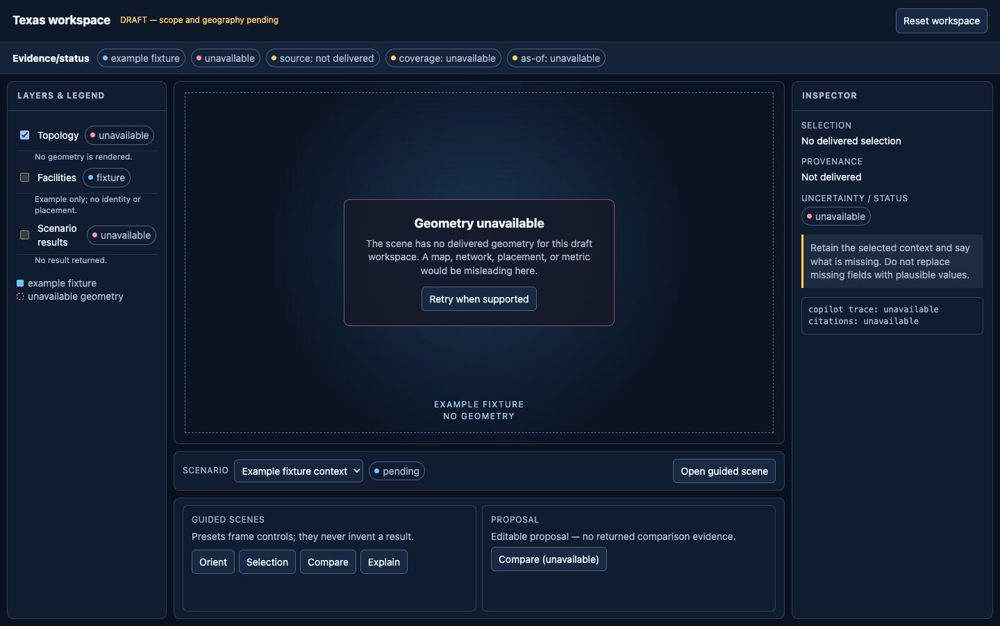
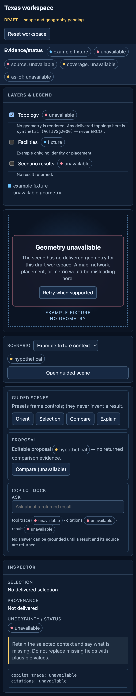

# Texas workspace narrative and information architecture

> **Legacy scope (D-5).** [`../specs/README.md`](../specs/README.md) declares
> [`10-minnesota-demo.md`](../specs/10-minnesota-demo.md) the current *planning* authority and this
> Texas framing superseded. This document is retained, not deleted, because it describes the
> geography the code actually serves (`copilot/routes/layers.py:44`, `:59`), and because its
> status-token and failure-state tables are the ones `web/src/` implements. Where it and the
> Minnesota IA disagree about `master`, this one has been the accurate of the two (see D-5b in
> [`../specs/spec-code-reconciliation.md`](../specs/spec-code-reconciliation.md)).

## Purpose and boundary

This is a reviewable interaction proposal, not a statement that a Texas
workspace, its geography, data, or effects are available. It may be used with
approved Texas inputs after the scope decision. Until then, every screen uses
labelled example fixtures and an unavailable geometry state.

The workspace follows a repeatable decision path:

1. orient to the current workspace and its evidence state;
2. select a declared scenario or comparison context;
3. inspect an asset, corridor, or place only when the delivered data identifies
   it;
4. compare a bounded proposal with its returned evidence; and
5. ask the copilot to explain returned results and their sources.

No example label in this document identifies a real facility, corridor,
location, score, result, or outcome.

## Information architecture

| Area | User purpose | Primary content | Empty/unavailable behavior |
| --- | --- | --- | --- |
| Workspace header | Establish context before interpretation | workspace name, scenario selector, timestamp, source/status strip | “Workspace context unavailable”; controls remain non-committal |
| Viewport | Orient and select delivered spatial entities | 3D scene, map fallback, selection focus, camera presets | A deliberately blank geometry field with an explicit unavailable label; never substitute a plausible map |
| Layer rail | Control visibility and interpret visual marks | layer names, legend, count, source/vintage/coverage/status | Retain each layer row and show unavailable or empty state rather than hide it |
| Inspector | Answer “what is selected, and what supports it?” | identity, attributes, provenance, uncertainty, linked evidence | Preserve selection context and name missing fields as unavailable |
| Scenario rail | Establish a comparison before results are read | selected scenario, baseline, timestamp, assumptions, reset | Disable comparison action with a reason and recovery path |
| Proposal tray | Frame a possible change without presenting it as approved | proposal inputs, validation state, returned comparison evidence | “No proposal result returned” with no implied benefit |
| Copilot dock | Explain product-returned evidence | prompt, tool trace, citations, result state | Explain that no answer can be grounded until a result/source is available |
| Guided scenes | Support a short review or demonstration | named visual presets and narration prompts | A preset may frame controls, but must not create geometry or metrics |

### Desktop hierarchy

```
┌──────────────── workspace header + persistent evidence/status strip ────────────────┐
│ workspace | scenario | as-of | topology/source class | coverage | status | reset  │
├───────────────┬──────────────────────── viewport ─────────────────────┬─────────────┤
│ Layer rail    │ camera / scene / selection                             │ Inspector   │
│ legend        │                                                        │ identity    │
│ visibility    │  unavailable geometry is an intentional scene state    │ provenance  │
│ truth labels  │                                                        │ caveats     │
├───────────────┴──────────────────── scenario + proposal tray ──────────┴─────────────┤
│ guided scene steps                                              copilot dock          │
└──────────────────────────────────────────────────────────────────────────────────────┘
```

On a narrower desktop, the inspector becomes a right-edge drawer and the
proposal tray stacks below the viewport. The evidence/status strip remains
visible in either layout: at narrow widths it **wraps onto additional rows**
rather than scrolling horizontally, so no status fact can be clipped off-screen
without a visible affordance. The committed mobile screenshot below is the
evidence for that claim.

## Narrative beats

| Beat | Question | Interaction | Required disclosure | Safe draft rendering |
| --- | --- | --- | --- | --- |
| 1. Orient | What am I looking at? | Open workspace and read the strip | source class, coverage, as-of, status | labelled fixture shell, geometry unavailable |
| 2. Focus | What can I inspect? | Select a layer or result returned by the product | identity and provenance before metrics | selection placeholder only |
| 3. Understand | Why is this visible? | Open inspector evidence tab | source, transformation/model state, caveats | “No delivered evidence” |
| 4. Compare | What changed under this declared proposal? | Set scenario and request comparison | baseline, proposal, assumptions, returned state | disabled comparison with reason |
| 5. Explain | Can the system substantiate the result? | Ask copilot; inspect tool trace/citations | result status and citations | unavailable-answer response |
| 6. Reorient | How do I return to a known context? | Reset scenario, selection, and camera | reset does not erase provenance | reset to unavailable fixture shell |

## Truth-label model

The renderer must accept the canonical 3D status vocabulary from the delivered
scene contract unchanged. The exact UI-status tokens are
`source_supported`, `source_screened`, `hypothetical`, `synthetic`,
`unavailable`, and `request_failed`. Artifact provenance remains a separate
three-value layer: `source_backed`, `synthetic`, or `unavailable`. A status is
shown both in the persistent strip and next to any selected entity or result.

Every token below is **derived from a field that already exists on `master`**,
named in the second column, in the same form the merged
[`minnesota-demo-narrative-ia.md`](minnesota-demo-narrative-ia.md) uses
(lines 223-230). A label with no named producer is not in the system: the
browser never invents one, and a token whose Texas producer does not exist yet
is not renderable until it does.

| UI status token | Derived from (server field on `master`) | Rendering rule in this workspace |
| --- | --- | --- |
| `source_supported` | **no Texas producer on `master`.** Minnesota's is `mn_score_results.regulatory_label == "source_supported"` (`../specs/10-duckdb-contract.md`); a Texas equivalent needs its own field and its own work item | not renderable until a Texas server field asserts it; no client-side substitute |
| `source_screened` | **no Texas producer on `master`** (same Minnesota-only field as above) | not renderable until a Texas server field asserts it |
| `hypothetical` | **no server field today.** It is the pre-submission lifecycle state of a proposal the user is editing; the proposal-state contract is Review decision 2 below | shown only on an un-submitted, editable proposal; never on a returned result |
| `synthetic` | `GET /scenarios` response `source_kind` in `fixture`/`simulated` with `topology == "synthetic (ACTIVSg2000)"` (`copilot/routes/scenarios.py:66-67`, constant at `:32`); the same literal is `SYNTHETIC_TOPOLOGY_LABEL` in `copilot/routes/layers.py:59` | render the server's full `topology` string verbatim — see "Naming the synthetic topology" below |
| `unavailable` | `FailureEnvelope.status == "unavailable"` (`copilot/api/envelope.py:63-64`), carrying one of the seven named reasons from `copilot/routes/layers.py:98-112` — `missing`, `no_rows`, `schema_mismatch`, `invalid_geometry`, `provenance_missing`, `not_built`, `query_failed` | show the token *and* the server's named reason; never a bare "unavailable" where a reason was supplied |
| `request_failed` | `FailureEnvelope.status == "error"` (`copilot/api/envelope.py:63-64`), or the SSE terminal `error` event (`../research/sse-event-schema.md:116`); every attempt emits exactly one terminal `done` **or** one terminal `error`, never both and never neither (`:106`, `:133`) | show the server-supplied cause. **Normative:** a stream that ends without a terminal `done` **or** `error` is `request_failed`, not `unavailable`, and carries the named code `stream_ended_without_terminal` rather than a bare sentence — decided as OQ-1 in [`../specs/spec-code-reconciliation.md`](../specs/spec-code-reconciliation.md) (2026-09-06) and implemented in `web/src/ask/run-state/reducer.ts` and `web/src/failure-states/adapters.ts` |

The provenance disclosures the layer rail and inspector require are already
produced for Texas by `copilot/routes/layers.py`: `coord_source` and
`source_name` are declared attributes (`:64-84`), and `source_ref` and
`source_version` are selected per row (`:88-95`) and returned in the layer
payload (`:139-166`). Artifact provenance (`source_backed`, `synthetic`,
`unavailable`) remains the separate axis defined in
[`3d-asset-contract.md`](3d-asset-contract.md) and
[`minnesota-gate-0-approval.md`](minnesota-gate-0-approval.md); it is not
interchangeable with the UI status axis above.

The Linear request uses the words “source-backed, synthetic, illustrative,
unavailable, failure, and proposal.” They are not one interchangeable status
axis. The requested word **illustrative** conflicts with the frozen 3D
contract: no server field asserts it and the browser must not display or
synthesize it. Use the following contract-bound dimensions instead:

| Requested wording | UI dimension | Design treatment |
| --- | --- | --- |
| source-backed | artifact provenance | show source link/reference, vintage, coverage, and transformations; do not infer that a visual mark is geographically authoritative |
| synthetic | artifact provenance and UI status | identify synthetic content plainly wherever it is shown |
| illustrative | prohibited browser-invented status | it is not an approved UI or artifact token. Do not display or synthesize it; a decorative class would require a server field and a new work item |
| unavailable | UI status | retain context, name the unavailable dependency, and offer reset/retry when supported |
| failure | UI status `request_failed` | show the server-supplied cause, preserve safe context, and offer a recovery action |
| proposal | UI status `hypothetical` plus action lifecycle | distinguish an editable hypothetical proposal from an approved, executed, or evidenced result |

The UI must not map an unknown token to a visual default. A fixture label marks
the origin of this prototype content; it is not a substitute for a rendered
artifact status.

### Naming the synthetic topology (ACTIVSg2000)

`CLAUDE.md:37` makes this a product invariant: **ACTIVSg2000 is synthetic
topology and must be labelled in user-visible results.** The server already
emits the identity, not the bare adjective — the literal string is
`"synthetic (ACTIVSg2000)"` (`copilot/routes/layers.py:59`,
`copilot/routes/scenarios.py:32,66-67`), and
`data/sources/texas-asset-taxonomy-v1.json` records that it is the only Texas
topology in the repository and that it is not ERCOT.

Therefore, in this workspace:

- the `synthetic` chip renders the server's `topology` string verbatim
  (`synthetic (ACTIVSg2000)`), never the bare word `synthetic`;
- no copy, narration, guided scene, or caption may describe ACTIVSg2000 as
  ERCOT, as a real Texas network, or as a utility's system; and
- the chip is shown wherever that topology reaches a user — strip, layer rail,
  inspector, comparison result, and any exported frame.

**Vintage disclosure is concrete, not generic.** The layer rail's "vintage"
field must name the ACTIVSg2000 version in play, because this project already
has one recorded vintage error: the June-2016 ACTIVSg2000 bundle is marked
"**do not use for coordinates**" — only 98 of its 2,000 bus numbers match the
installed pip case — while the current-version AUX maps all 2,000
(`DEPENDENCIES.md:53-54`, `CLAUDE.md:38-39`). Coordinates therefore come from
the current AUX only, `coord_source` is never `tamu_xlsx`, and a vintage
disclosure that says only "2016" or only "ACTIVSg2000" is insufficient.

## Visual system

The prototype uses a dark field for spatial context, an off-white reading
surface for provenance, and high-contrast state chips. Shape and plain text,
not hue alone, carry state. The visual hierarchy is:

1. evidence/status strip before the viewport;
2. selected identity and provenance before analytic detail;
3. scenario and proposal inputs before a comparison result; and
4. citations/tool trace before copilot prose that relies on them.

Example fixture content is tinted and watermarked “EXAMPLE FIXTURE.” The
unavailable viewport is intentionally sparse: it contains no substitute
network, county boundary, asset pin, value, or placement.

## Guided-scene contract

Guided scenes are camera and panel presets only. A scene may request a layer,
selection, and copy key, but receives geometry and facts solely from product
data. The four neutral presets are:

- **Orientation:** show the evidence/status strip and layer legend.
- **Selection:** open the inspector after a product-delivered selection.
- **Comparison:** open scenario/proposal controls before any returned result.
- **Explanation:** expand copilot trace and citations for a returned result.

## Reconciliation with existing specs and the shared shell

**`../specs/06-frontend.md` still governs the Texas/five-bus screen.** The
merged Minnesota IA supersedes 06's tool-to-map linkage *for the Minnesota
surface only* and states explicitly that "06's linkage continues to govern the
existing Texas/five-bus screen unchanged"
(`minnesota-demo-narrative-ia.md:196-210`). 06 describes a different screen from
this one: nine deck.gl layers, line-loading colour ramps, county outage risk,
cascade playback, site pins and critical loads (`06-frontend.md:9`), with
"Texas (`uri_2021`, hour 0) … the planned topology-backed path"
(`06-frontend.md:11`). This document does **not** supersede it. Specifically:

| 06 element | This IA | Why |
| --- | --- | --- |
| Nine deck.gl layers, line loading, county choropleth, storm polygon, site pins, critical loads | **deferred** — each is a layer *row* in the layer rail with an `unavailable` state until its artifact is delivered | Every one of those sources is `unavailable` in `data/sources/texas-p0-inventory.json`; the rail keeps the row rather than hiding it (see the IA table above) |
| Cascade playback driven by a `run_cascade` tool call | **deferred, and constrained** — as in Minnesota, a tool call renders as an evidence chip and drives no camera, hour, layer, or selection until the cascade artifact is delivered | A tool-triggered animation would assert topology behaviour this document does not claim |
| `uri_2021` topology path on the checked-in five-bus fixture | **kept, unchanged** — 06 remains authority for that screen | This IA describes the Texas *workspace* shell, not the five-bus preview |
| Basemap (`06-frontend.md:21`, OpenFreeMap/MapLibre with Protomaps fallback) | **kept as a basemap only** — the "map fallback" in the IA table means the basemap tile provider falling back, never a substitute network, boundary, or placement drawn under an unavailable layer | Resolves the apparent conflict with "never substitute a plausible map" |
| The `POST /ask` box | **kept** — it is the copilot dock in this IA | `POST /ask` exists on `master` as a transport (`copilot/routes/ask.py:139`, mounted at `copilot/app.py:75`); its answer backend is deployment-injected, so see the dependency table below |

**Mapping onto the shared shell (2WKG-312, open PR #191).** That PR ships one
shell with typed `viewport`, `controls`, `inspector`, `timeline`, `comparison`
and `chat` slots and names 2WKG-309 as a prerequisite, so the eight areas above
are a *narrative* vocabulary that must land in its six slots, not a competing
layout:

| Area in this IA | Shell slot (2WKG-312) |
| --- | --- |
| Workspace header + evidence/status strip | shell chrome plus the shell's required truth label (not a slot of its own) |
| Viewport | `viewport` |
| Layer rail | `controls` |
| Scenario rail | `controls` (scenario/baseline selection) and `timeline` (as-of / hour axis) |
| Inspector | `inspector` |
| Proposal tray | `comparison` |
| Copilot dock | `chat` |
| Guided scenes | not a slot — a preset that sets `controls`, `viewport` camera and `inspector` state; it renders nothing itself |

The four guided-scene presets here (Orientation, Selection, Comparison,
Explanation) are **interaction** presets and are deliberately not the same
vocabulary as Minnesota's five **question** scenes (Coverage, Stress, Aggregate
metric, Facility comparison, Evidence,
`minnesota-demo-narrative-ia.md:52-58`): Minnesota's are named after the
question a presenter asks of delivered artifacts, and none of the Texas
artifacts those questions need is delivered. When Texas artifacts land, the
Texas presets are expected to be re-cut on Minnesota's question axis; until
then, naming them after questions would imply answers that do not exist.

**Dependencies, with a ticket or an explicit absence.** Every row is a
dependency statement, not a completion claim.

| This IA needs | State on `master` | Delivered by |
| --- | --- | --- |
| Frozen UI status and artifact-provenance vocabulary | exists (`3d-asset-contract.md:73-75`, `minnesota-gate-0-approval.md:51-66`) | merged |
| Texas provenance payload (`coord_source`, `source_name`, `source_ref`, `source_version`) and named unavailable reasons | exists (`copilot/routes/layers.py:59-112`) | merged |
| Scenario `source_kind` / `topology` labels | exists (`copilot/routes/scenarios.py:32,66-67`) | merged |
| Failure envelope statuses | exists (`copilot/api/envelope.py:63-64`) | merged |
| Responsive shell with typed slots | does not exist on `master` | **2WKG-312** (open PR #191) |
| Copilot dock: `POST /ask` route | **exists, and is now wired** (`copilot/routes/ask.py`, mounted by `copilot/app.py`). Until 2WKG-230 the tool plan was deployment-injected and *nothing in the repository injected one*, so the dock rendered `unavailable` with any configuration; `create_app` now builds one with `copilot.agent.build_ask_backend`. With no provider credential the dock still renders the same named `unavailable` state | transport merged; the answer path is **2WKG-230** |
| Copilot dock: SSE tool trace, citations and terminal `done`/`error` | event primitives exist (`copilot/sse.py`) and the schema is documented (`../research/sse-event-schema.md`), streamed by the ask transport | lifecycle and error behaviour **2WKG-126** / **2WKG-127** |
| 3D scene, camera presets and archetypes for Texas | contract exists (`3d-asset-contract.md`, `data/3d/asset-archetypes-v1.json`); no Texas twin | **2WKG-311** (Texas 3D twin), **2WKG-318** (picking), **2WKG-320** (asset pipeline) |
| Texas geometry, county boundaries, outage, hazard and facility layers | every source is `unavailable` or `excluded` in `data/sources/texas-p0-inventory.json` except `activsg2000-current` | **no ticket yet** for the layer set as a whole; source receipts are in flight in PR #199 |
| Texas source-supported / source-screened status producer | does not exist on `master` (Minnesota-only field) | **no ticket yet** |
| Proposal lifecycle states | does not exist | **no ticket yet** — Review decision 2 below |

## Acceptance for the implementation handoff

- The viewport, inspector, layer rail, scenario/proposal controls, copilot
  dock, and guided scenes are all represented in the shell.
- The shell reserves a persistent source/status strip supplied by data props;
  as a *status* value it renders only `source_supported`, `source_screened`,
  `hypothetical`, `synthetic`, `unavailable`, or `request_failed` — plus the
  fixture-origin label defined above, which marks where prototype content came
  from and is never a status — and it does not calculate provenance, geography,
  or effects. The `synthetic` status renders the server's full `topology`
  string (`synthetic (ACTIVSg2000)`).
- Each layer and inspector supports source/vintage/coverage/transformation or
  calibration/uncertainty/status disclosures when delivered.
- Unknown, empty, unavailable, malformed, and failure responses remain
  visible and distinguishable; no visual fallback implies missing geometry or
  results.
- A proposal is visibly editable and pending until a returned result names its
  state; no wording implies approval, execution, or benefit.
- Fixture examples are labelled as fixtures. The standalone prototype contains
  no Texas geographic feature, source-backed placement, metric, or effect
  claim.
- Keyboard focus reaches every visible control, state is expressed in text,
  and motion is optional.

## Standalone prototype and screenshots

The prototype is a single self-contained file,
[`texas-workspace-prototype.html`](texas-workspace-prototype.html). It is a
static skeleton of this IA: it wires no data, calls no route, and renders no
geometry. Two committed captures show it in both layouts:

- 
  **Desktop, 1440x900 CSS px, DPR 1 (1440x902 px file).** Header and persistent
  evidence/status strip, layer rail with per-layer status, unavailable-geometry
  viewport, inspector, and the guided-scene / proposal / copilot-dock row.
- 
  **Mobile, 390 CSS px wide at DPR 2, whole column (780x3960 px file; the
  1,980 CSS px window height is chosen to contain the full page).** The
  `max-width:700px` branch: single column, status strip wrapped onto three rows
  so all five status facts stay on screen, panels stacked in reading order.

### Capture recipe

Both PNGs are produced headlessly from the committed HTML, with no server and
no new dependency, using the Chrome headless shell already present via
Playwright:

```sh
SHELL_BIN="$HOME/Library/Caches/ms-playwright/chromium_headless_shell-1243/chrome-headless-shell-mac-arm64/chrome-headless-shell"
PAGE="file://$PWD/docs/design/texas-workspace-prototype.html"

# Desktop: 1440x900 CSS px, device pixel ratio 1.
"$SHELL_BIN" --headless --disable-gpu --hide-scrollbars \
  --window-size=1440,902 \
  --screenshot=docs/design/texas-workspace-prototype-desktop.png "$PAGE"

# Mobile: 390 CSS px wide at DPR 2; the window is tall enough for the whole column.
"$SHELL_BIN" --headless --disable-gpu --hide-scrollbars \
  --window-size=390,1980 --force-device-scale-factor=2 \
  --screenshot=docs/design/texas-workspace-prototype-mobile.png "$PAGE"
```

Any headless Chromium works; only the viewport sizes and the device pixel
ratios are part of the evidence. Re-capture both files whenever the HTML
changes, or the screenshots stop being evidence for it.

## Review decisions still needed

1. Confirm whether Texas is the authorized primary product geography and what
   geography, if any, the first review build may render.
2. Decide which proposal lifecycle states are product-supported. This design
   treats all proposals as an editable `hypothetical` until that contract
   exists.

Two questions an earlier draft left open are **answered on `master`** and are
recorded above rather than asked again:

- *Where do the frozen status and artifact-provenance fields live?*
  `FailureEnvelope.status` in `copilot/api/envelope.py:63-64` for
  `unavailable` / `request_failed`; `source_kind` and `topology` in
  `copilot/routes/scenarios.py:66-67` for `synthetic`; the artifact-provenance
  axis is frozen in `minnesota-gate-0-approval.md:51-66`. No Texas producer
  exists for `source_supported` or `source_screened`.
- *What are the authoritative provenance payload fields?* `coord_source`,
  `source_name`, `source_ref` and `source_version`, produced for Texas by
  `copilot/routes/layers.py:64-95` and returned per feature at `:139-166`, with
  the seven named unavailable reasons at `:98-112`. The inspector links those
  and nothing else.
